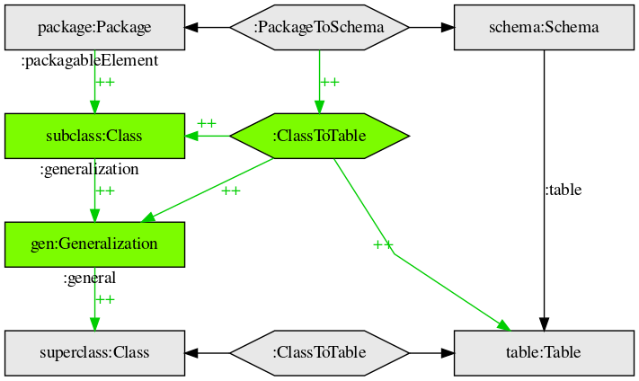
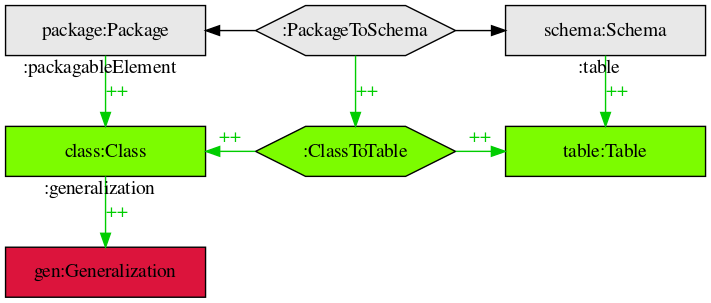

# Triple graph grammar Graphviz DOT template 

An
[alright template](tgg-template.dot)
for representing
[triple graph grammars](https://de.wikipedia.org/wiki/Tripel-Graph-Grammatik)
in the
[Graphviz DOT language](https://www.graphviz.org/doc/info/lang.html).

## Example graphs

Example graphs are based on [this animation](https://commons.wikimedia.org/wiki/File:TGG_Classes2Tables_Transformation_Process_anim_(en).gif).

### Making the images

     $ dot -Tpng tgg-template-example-1.dot > tgg-template-example-1.png
     $ dot -Tpng tgg-template-example-2.dot > tgg-template-example-2.png
