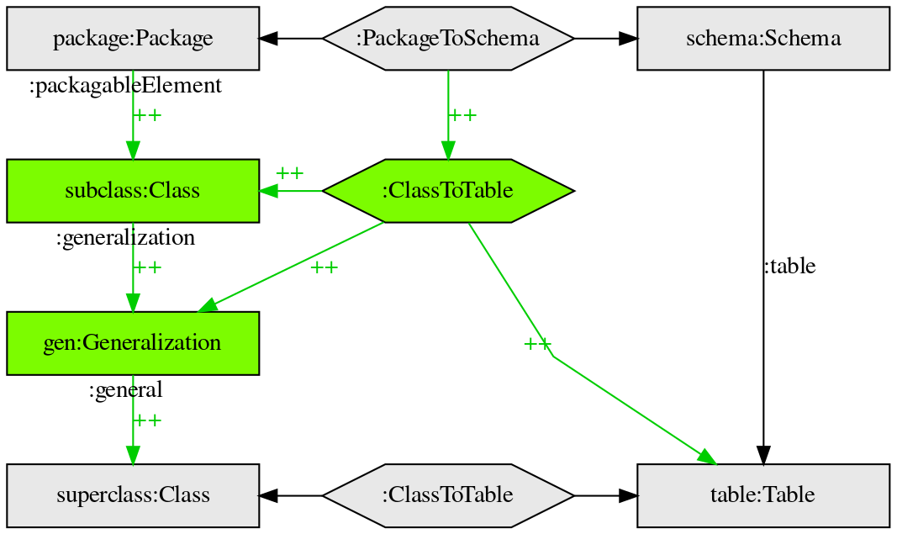

# Triple graph grammar Graphviz DOT template 

An alright template for representing triple graph grammars in the Graphviz DOT language.

## Example image

## Making the image

     $ dot -Tpng tgg-template-example.dot > tgg-template-example.png
