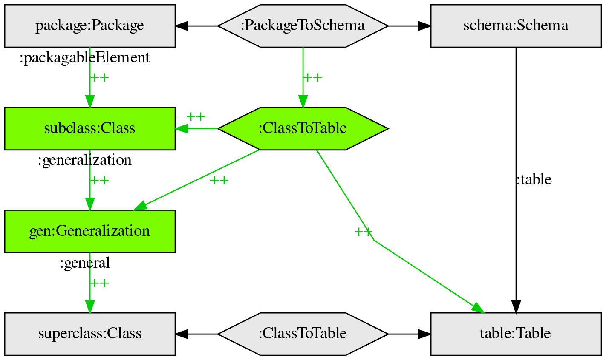

# Triple graph grammar Graphviz DOT template 

An alright template for representing triple graph grammars in the Graphviz DOT language.

## Example image

Example graphs are based on graphs from [this animation](https://commons.wikimedia.org/wiki/File:TGG_Classes2Tables_Transformation_Process_anim_(en).gif).

### Making the images

     $ dot -Tpng tgg-template-example-1.dot > tgg-template-example-1.png
     $ dot -Tpng tgg-template-example-2.dot > tgg-template-example-2.png
